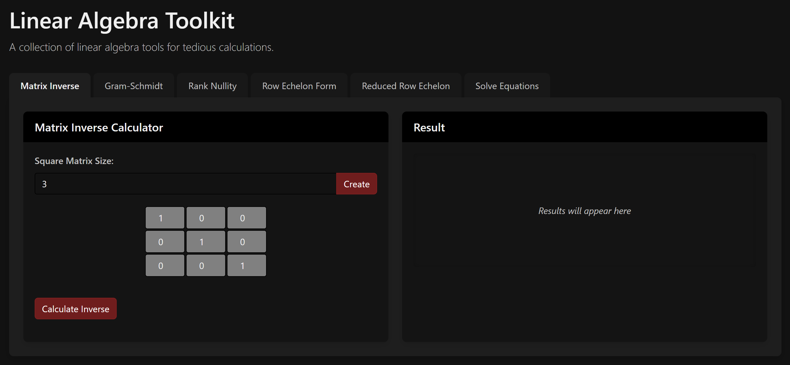
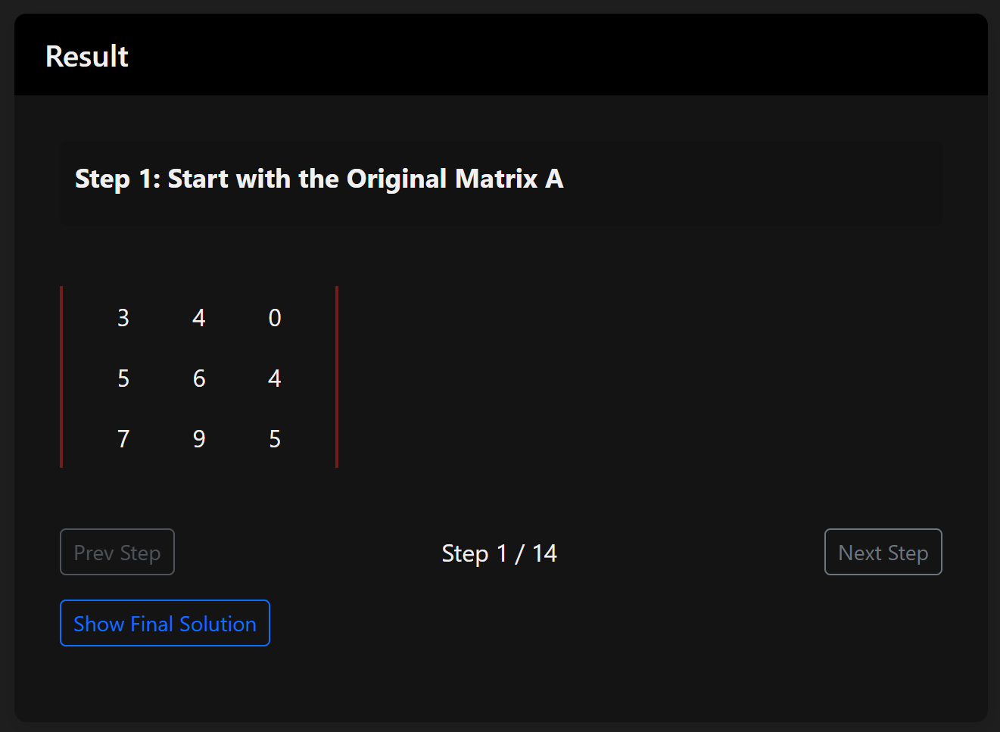

#  Linear Algebra Toolkit (Flask + Bootstrap)

A web-based interactive toolkit for learning and solving linear algebra problems. Built using **Flask** for the backend API and **Bootstrap** for a responsive frontend. This tool-kit provides **step by step** solutions for the provided problems.

##  Features

-  Matrix Inversion (Step-by-step Gauss-Jordan)
-  Gram-Schmidt Orthonormalization
-  Rank-Nullity Verification
-  Row Echelon Form (REF)
-  Reduced Row Echelon Form (RREF)
-  Solve Systems of Linear Equations (via Augmented Matrix)

##  Tech Stack

- **Frontend:** HTML, CSS (Bootstrap 5), JavaScript
- **Backend:** Python Flask
- **API Hosting:** Render.com  
- **Frontend Hosting:** Vercel (via `/frontend` folder)

## Some screenshots of the UI (and the step navigation)

